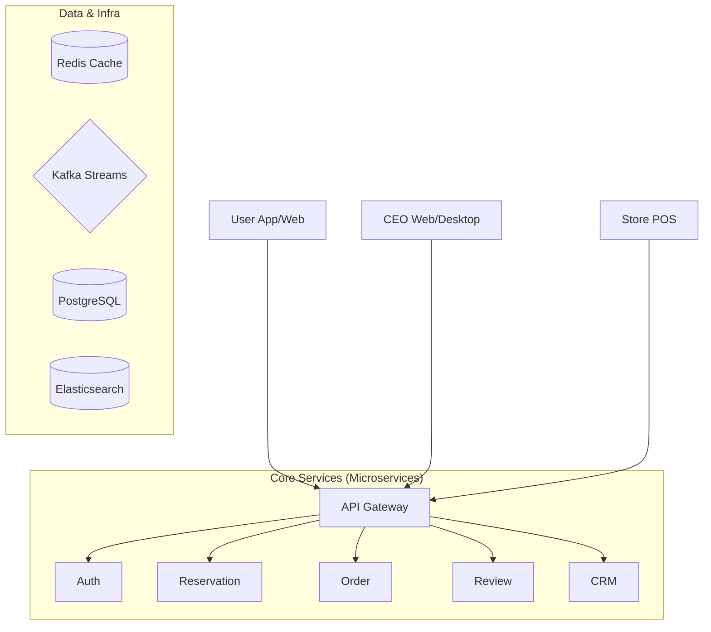

# 🍽️ Fooding (푸딩)
> **외식업 운영의 모든 것을 하나로 연결하는 올인원 플랫폼**
>
> 예약, 웨이팅, POS, 고객 관리(CRM), 그리고 식자재 마켓까지. 사장님과 손님 모두에게 끊김 없는 경험을 제공합니다.

---

## 📖 Contents
- [🍽️ Fooding (푸딩)](#️-fooding-푸딩)
  - [📖 Contents](#-contents)
  - [Project Overview](#project-overview)
    - [🚩 Problem](#-problem)
    - [💡 Solution](#-solution)
  - [Service Links](#service-links)
    - [Public Sites](#public-sites)
    - [App Downloads](#app-downloads)
  - [Key Modules](#key-modules)
  - [Core Features](#core-features)
  - [System Architecture](#system-architecture)
  - [Business Model](#business-model)
  - [Roadmap \& Status](#roadmap--status)
    - [✅ Completed](#-completed)
    - [🚧 In Progress](#-in-progress)
  - [Impact Metrics](#impact-metrics)
  - [Team](#team)
  - [Directory Structure](#directory-structure)

---

## Project Overview
**Vision**: "단 하나의 앱으로 연결되는 미식 경험"

기존 외식업 시장은 예약, POS, 웨이팅, 마케팅, 식자재 구매가 모두 파편화되어 있었습니다. **Fooding**은 이를 통합하여 사장님에게는 **효율적인 운영**을, 손님에게는 **편리한 미식 생활**을 제공합니다.

### 🚩 Problem
- **For Owner**: 예약, POS, 웨이팅, 배달 등 너무 많은 관리 도구, 비싼 수수료, 흩어진 데이터.
- **For User**: 광고성 리뷰에 대한 피로감, 예약/웨이팅/주문의 번거로운 과정, 통합되지 않는 포인트.

### 💡 Solution
- **All-in-One**: 앱 하나로 매장 탐색부터 예약, 주문, 결제, 리뷰까지 해결.
- **Cost Saving**: 파트너 마켓을 통한 식자재 도매가 공급 및 합리적인 플랫폼 수수료.
- **Seamless UX**: 온/오프라인이 연결된 사용자 경험 (User App ↔ Store POS).

---

## Service Links
### Public Sites
| Service | Link |
|:---:|:---|
| **Fooding User (Web)** | [https://fooding.im/](https://fooding.im/) |
| **Fooding CEO (Web)** | [http://ceo.fooding.im/](http://ceo.fooding.im/) |

### App Downloads
| Product | Android | iOS | Windows | Mac |
|:---:|:---:|:---:|:---:|:---:|
| **Fooding POS** | _TBD_ | _TBD_ | _TBD_ | _TBD_ |
| **Fooding 매장관리** | _TBD_ | _TBD_ | _TBD_ | _TBD_ |

---

## Key Modules
각 모듈의 이름을 클릭하면 상세 명세 문서로 이동합니다. 모든 모듈 관련 에셋은 `projects/fooding/products/<module>/assets/`에 정리합니다.

| Module | Target | Description |
|:---|:---:|:---|
| [**Fooding User**](./products/fooding-user/README.md) | 고객 | 지역 맛집 탐색, 실시간 예약/웨이팅, 영수증 인증 리뷰, 통합 포인트 지갑 |
| [**Fooding POS**](./products/fooding-pos/README.md) | 매장 | 테이블/QR 주문, 주방 디스플레이(KDS), 매출 리포트, CRM 연동 |
| [**Fooding App (매장용)**](./products/fooding-app/README.md) | 직원 | 모바일 웨이팅 접수, 예약 관리, 호출 응대, 포인트 적립 |
| [**Fooding Place**](./products/fooding-place/README.md) | 마케팅 | 노코드(No-code) 매장 웹사이트 빌더, SEO 최적화, 예약 연동 |
| [**Fooding Partner**](./products/fooding-partner/README.md) | B2B | 식자재/기기 최저가 구매, 정기 배송, 입점 업체 관리 |
| [**Fooding CEO**](./products/fooding-ceo/README.md) | 사장님 | 다지점 통합 대시보드, 매출/고객 분석, 직원 관리, 커뮤니티 |

---

## Core Features
1. **스마트 예약 & 웨이팅**
   - 노쇼 방지를 위한 보증금 시스템 및 AI 기반 혼잡도 예측.
   - 현장 키오스크와 앱의 실시간 대기열 연동.
2. **신뢰 기반 리뷰 & 리워드**
   - 영수증/위치 인증 기반의 클린 리뷰 시스템.
   - 통합 마일리지로 모든 제휴 매장에서 현금처럼 사용 가능.
3. **데이터 기반 CRM**
   - 단골 고객 자동 분류 및 타겟 마케팅 (쿠폰, 알림톡).
   - 사장님 전용 커뮤니티 및 1:1 컨설팅 챗봇.
4. **B2B 마켓플레이스**
   - 검증된 식자재 파트너사 입점 및 익일 배송 인프라.

---

## System Architecture


- **Frontend**: React Native, Electron (Desktop), Tailwind CSS, Storybook
- **Backend**: Spring Boot (WebFlux), QueryDSL, Kotlin
- **Infra & Data**: Docker Compose, Kafka, Elasticsearch, Redis, SSE (Realtime), AWS S3

---

## Business Model
- **Platform Fee**: B2B 파트너 거래 수수료 (5~10%), 예약 보증금 수수료.
- **Subscription**:
  - **Starter**: 무료 (기본 POS/예약)
  - **Pro**: 월 99,000원 (CRM 심화, 리워드 프로그램)
  - **Enterprise**: 월 299,000원 (프랜차이즈 관리, API 연동)

---

## Roadmap & Status
### ✅ Completed
- [x] **Frontend**: 사용자 대기 UI, 리뷰/쿠폰 UX, CEO 포인트샵 개편.
- [x] **Backend**: 단골 관리 API, Kafka 이벤트 파이프라인, SSE 실시간 알림 시스템.
- [x] **Infra**: ELK 스택 기반 로그/검색 환경 구축.

### 🚧 In Progress
- [ ] Redis 캐싱 전략 고도화 (Cache Stampede 방지).
- [ ] 추천 시스템 도입 (협업 필터링 기반 맛집 추천).
- [ ] Place/Partner 도메인 간 결제 통합 테스트.

---

## Impact Metrics
| Metric | Value | Note |
|:---:|:---:|:---|
| **MAU** | 3.0M+ | 월간 활성 사용자 |
| **Stores** | 50,000+ | 입점 매장 수 |
| **Trans. Vol** | 3,000억+ | 연간 POS 거래액 |
| **Rating** | 4.8/5.0 | 사장님 만족도 |

---

## Team
저희 팀원들의 이름을 클릭하면 상세 프로필을 확인할 수 있습니다.

| Name | Role | Email | Key Contributions | Links |
|:---:|:---|:---|:---|:---|
| [**강주영**](./members/jooyoung_kang.md) | **Leader** · Infra | karjyk@gmail.com | 프로젝트 총괄, CI/CD 파이프라인, 아키텍처 설계 | [Blog](https://velog.io/@kkang_/posts) |
| [**정영현**](./members/younghyeon_jeong.md) | Backend | jeongyounghyeon1106@gmail.com | API Gateway, 웨이팅 SSE, 성능 최적화 | [GitHub](https://github.com/Jeongyounghyeon) |
| [**김지연**](./members/jiyeon_kim.md) | Frontend | cleo0718@gmail.com | User App 메인 개발, 예약/리뷰 UX 고도화 | [GitHub](https://github.com/CLEO525) |
| [**진혜민**](./members/hyemin_jin.md) | Backend | hmjin11@gmail.com | 검색 엔진(ES) 구축, 포인트/리워드 시스템 | [GitHub](https://github.com/hmJin11) |
| [**고윤아**](./members/yuna_ko.md) | Design | ko.yuna0412@gmail.com | User App UI/UX, 브랜드 아이덴티티, 프로토타이핑 | [LinkedIn](https://www.linkedin.com/in/%EC%9C%A4%EC%95%84-%EA%B3%A0-2804a8306/) |
| [**김모경**](./members/mokyung_kim.md) | Frontend | monee1001@naver.com | CEO 고객관리 페이지, 매장용 리워드 앱 개발 | [GitHub](https://github.com/moneekim) |
| [**이원종**](./members/wonjong_lee.md) | Frontend | leewj5192@gmail.com | Electron 기반 CEO 데스크탑 앱, 매장용 웨이팅 앱 | [GitHub](https://github.com/leewj5192) |
| [**지윤서**](./members/younseo_ji.md) | Design | jysjys7620@naver.com | 사장님(CEO) 대시보드 디자인, 마케팅 에셋 제작 | [LinkedIn](https://www.linkedin.com/in/younseo-ji-10a5053a0) |
| [**임성제**](./members/seongje_lim.md) | Backend | seongje00416@gmail.com | WebFlux 리액티브 모듈, 실시간 알림 서버, 통계 API | [GitHub](https://github.com/seongje00416) |
| [**신상호**](./members/sangho_shin.md) | Frontend | nononcrust@gmail.com | 디자인 시스템 구축, 공통 컴포넌트 라이브러리 관리 | [Blog](https://nonon.dev/) |

---

## Directory Structure
```
projects/fooding/
├── fooding.md            # Product Spec
├── README.md             # Project Introduction
├── products/             # Module Documentation & Assets
├── docs/
│   ├── frontend/         # Frontend guides & assets
│   ├── backend/          # Backend/Infra/CICD/Runbooks
│   ├── design/           # Design system, research, handoff
│   └── shared/           # Cross-team references
├── features/             # Worklogs (Frontend/Backend/Design/Plan)
├── members/              # Team Profiles
└── ...                   # Metrics, deliverables, etc.
```
