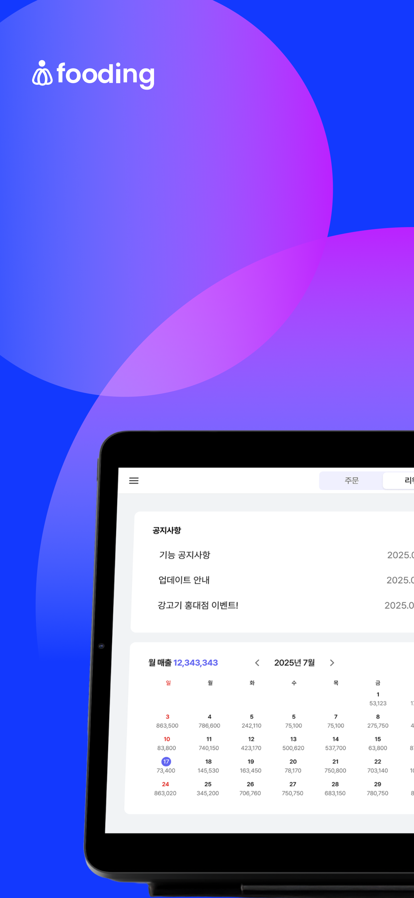
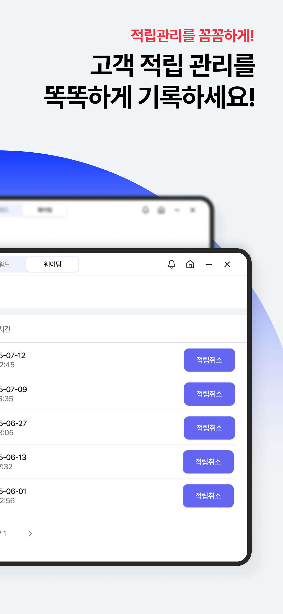
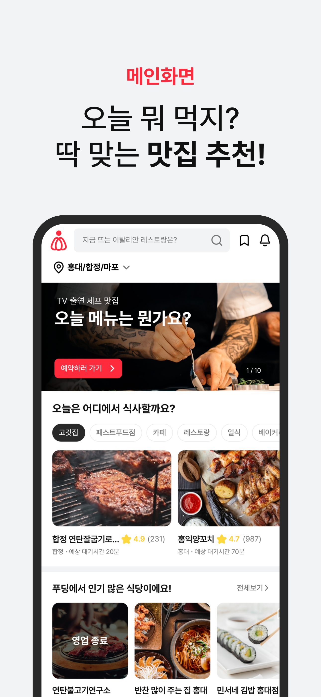

# Fooding Product Modules

Fooding은 다양한 접점(고객 앱, 사장님 도구, 파트너 마켓 등)을 하나의 경험으로 묶는 것을 목표로 합니다. 이 디렉터리는 제품 모듈별 스냅샷과 상세 문서를 분리해 두어, 이해관계자가 필요한 정보를 빠르게 찾을 수 있도록 구성했습니다.

## Directory Layout
```
products/
├── README.md
├── fooding-user/
│   ├── README.md          # 모듈 설명
│   └── assets/            # 스크린샷, 다이어그램 등
├── fooding-pos/
│   ├── README.md
│   └── assets/
├── fooding-app/
│   ├── README.md
│   └── assets/
├── fooding-place/
│   ├── README.md
│   └── assets/
├── fooding-partner/
│   ├── README.md
│   └── assets/
└── fooding-ceo/
    ├── README.md
    └── assets/
```

## Module Snapshot
| Module | Target | 핵심 라벨 | 문서 |
| --- | --- | --- | --- |
| Fooding User | 고객 | 지역 기반 검색, 예약·웨이팅, 인증 리뷰, 통합 리워드 | [`fooding-user/README.md`](fooding-user/README.md) |
| Fooding POS | 매장 | 테이블/QR 주문, 주방 관리, 결제, CRM | [`fooding-pos/README.md`](fooding-pos/README.md) |
| Fooding App (매장용) | 사장님/직원 | 모바일 웨이팅/예약, 포인트 적립, 쿠폰 발급 | [`fooding-app/README.md`](fooding-app/README.md) |
| Fooding Place | 매장 | 노코드 웹사이트 빌더, 템플릿, SEO, 예약 연동 | [`fooding-place/README.md`](fooding-place/README.md) |
| Fooding Partner | B2B | 식자재/설비 마켓플레이스, 대량·정기 구매 | [`fooding-partner/README.md`](fooding-partner/README.md) |
| Fooding CEO | 사장님 | 멀티 매장 대시보드, 매출/CRM 분석, 커뮤니티 | [`fooding-ceo/README.md`](fooding-ceo/README.md) |

## Visual Snapshot

| Fooding User | Fooding POS | Fooding App (매장용) |
| :---: | :---: | :---: |
|  |  |  |

| Fooding CEO | Fooding POS · 웨이팅 | Fooding User · 예약 |
| :---: | :---: | :---: |
|  |  |  |

## How to Use
1. README 내 표를 통해 원하는 모듈 문서를 빠르게 탐색합니다.
2. 각 문서는 **핵심 가치 → 사용자 여정 → 기능/지표 → 인프라 의존성 → 로드맵** 순으로 작성되어 있습니다.
3. 이미지, 프로토타입, 다이어그램 등은 각 모듈의 `assets/` 폴더에 함께 보관합니다.
4. 신규 모듈을 추가할 경우 동일한 폴더 구조를 생성하고 본 README의 Snapshot 표에도 링크를 추가하세요.
